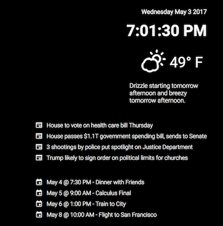

# smart-mirror

This is a node web app for a smart mirror on a device like a Rasberry Pi. It can keep track of things like: date, time, calendar events, news, weather, and more!

Here's a sample of the current UI:

## Summary
The current application gets your location via the HTML5 Geolocation API. Below that it displays the weather, via the Dark Sky API, followed by a 24-hour forcast summary. Followed by the top 4 stories off of the associated press RSS feed. Below that is your 5 most recent google calendar events displayed with their time and date.

## Licenses

- [MIT License](LICENSE) - License for this code (unless otherwise specified).
- [Roboto Font License](https://www.apache.org/licenses/LICENSE-2.0.html) - Apache 2.0 License
- [Node License](https://github.com/nodejs/node/blob/master/LICENSE) - License for the Nodejs runtime environment.
- [Dark Sky Terms of Service](https://darksky.net/dev/docs/terms) - Terms of service for Dark Sky API.
- [Skycons License](https://creativecommons.org/publicdomain/zero/1.0/) - These are animated weather icons made by the people at Dark Sky. Link [here](https://github.com/darkskyapp/skycons).
- [Google Calendar License](https://developers.google.com/google-apps/calendar/terms) - Terms of service for Google Calendar API.
- [Associated Press](https://www.ap.org/terms-and-conditions/) - Terms and Conditions.